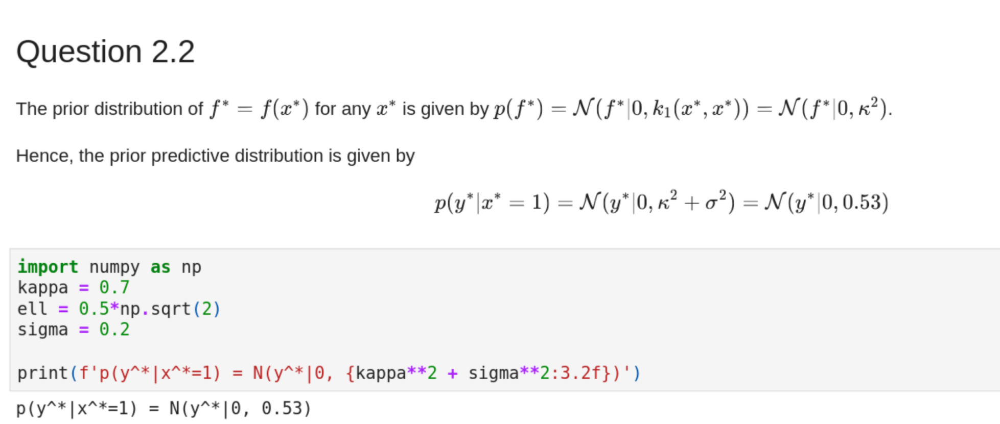
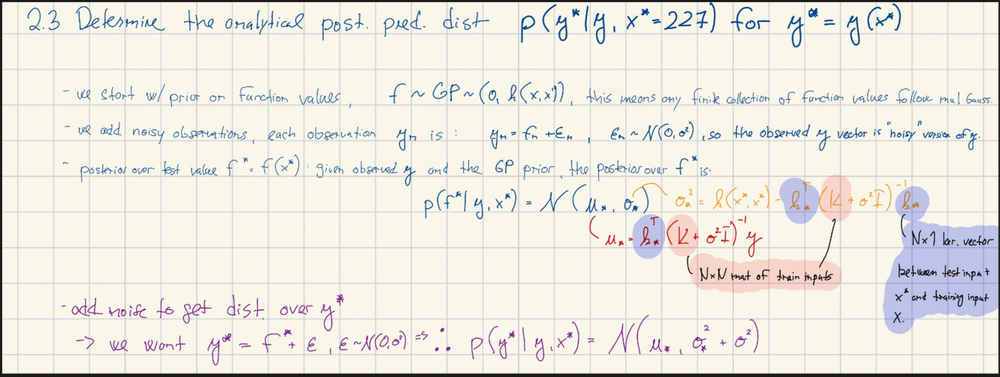
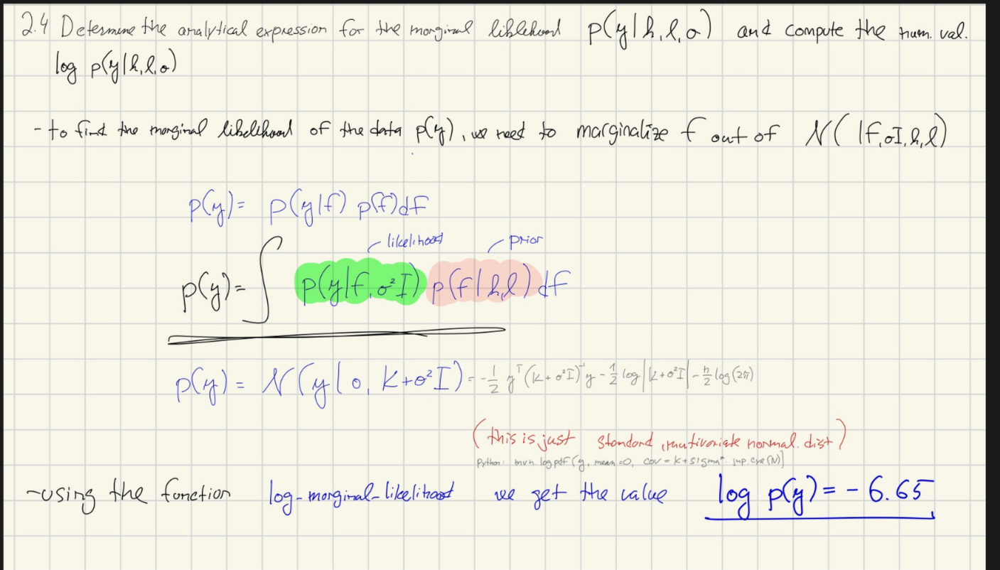
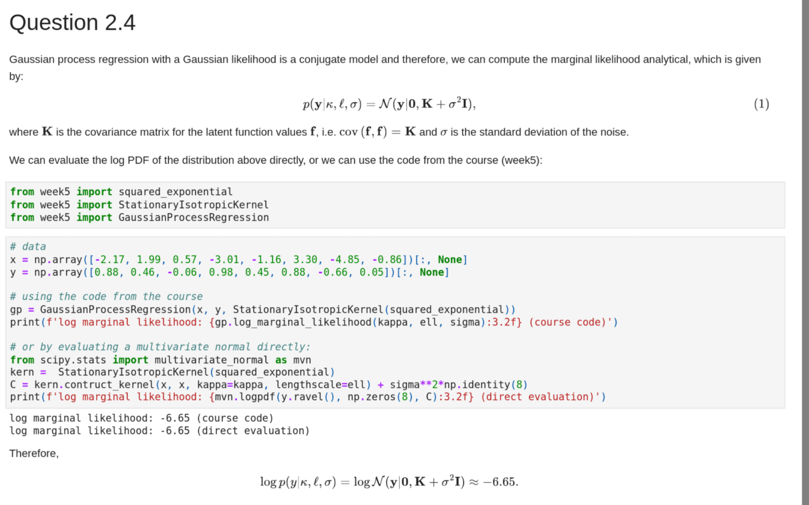

# Task 1: 

# Task 2: Gaussian Processes Regression

## Part 2.1

\fig{image-1.png}{My Caption}

## Part 2.2

### In hand solution
\fig{image-2.png}{My Caption}

### My solution 

```python
x = jnp.array([-2.17, 1.99, 0.57, -3.01, -1.16, 3.30, -4.85, -0.86]).reshape(-1, 1) # need to reshape to (n, 1)
print(f"Shape of X: {x.shape}")
y = jnp.array([0.88 ,0.46 ,-0.06, 0.98, 0.45,0.88 ,-0.66, 0.05])[:, None]  
print(f"Shape of y: {y.shape}")

# hyperparemeters
kappa = 0.7 
ell = 0.5 * jnp.sqrt(2)
sigma = 1/5

# Define the kernel 
kernel = GP.StationaryIsotropicKernel(kernel_fun=GP.squared_exponential, kappa=kappa, lengthscale=ell)

# define the model 
GP_ = GP.GaussianProcessRegression(X=x, y=y, kernel=kernel, kappa=kappa, lengthscale=ell, sigma=sigma)

# prior predictive distribuion 

# x* = 1 # the prediction point 
x_star = jnp.array([1])

# get the mean and variance from the prior_predictive of y star 
prior_pred_y_mean, prior_pred_y_var = GP_.prior_predictive_y_star(Xstar=x_star)

# we can get the same by using the 
pror_pred_f_mean, prior_pred_f_mean = GP_.prior_predictive_f_star(Xstar=x_star)

print(f"Prior pred mean of y*: {prior_pred_y_mean.item():3.2f}")
print(f"Prior pred var of y*: {prior_pred_y_var.item():3.2f}")

print(f"Prior pred mean of f*: {pror_pred_f_mean.item():3.2f}")
print(f"Prior pred var of f*: {prior_pred_f_mean.item():3.2f}")
```


### Teachers solution
{ width=80% }


```python
print(f"p(y^* | x^*=1) = N(y^*| 0, {kappa**2 + sigma**2:3.2f})")
```
## Part 2.3
{ width=80% }
## Part 2.4

{ width=80% }


```python
log_marginal = GP_.log_marginal_likelihood(kappa=kappa, lengthscale=ell, sigma=sigma)

print(f"The value of log marginal marginal likelihood log p(y) = {log_marginal:.2f} ")
```

### Teachers solution 
{ width=80% }


## Part 2.5
```python
x_star = jnp.array([1])

mu_f, var_f = GP_.predict_f(Xstar=x_star)
print(f"The analytical posterior distribution p(f*|y, x*=1) = N(f*|{mu_f.item():.2f}, {var_f.item():.2f})")
mu_y, var_y = GP_.predict_y(Xstar=x_star)
print(f"The analytical posterior distribution p(y*|y, x*=1) = N(f*|{mu_y.item():.2f}, {var_y.item():.2f})")
```

## Part 2.6

## Part 2.7
```python
def squared_exponential_2(x1, x2, c1, c2, lengthscale):
    return  (( 1 + jnp.abs(x1 - x2) / (2 * lengthscale**2))**(-1)) + x1 * x2 

x_star = jnp.array([-1]).reshape(-1)
kernel2 = squared_exponential_2(x1=x, x2=x_star, c1=1, c2=1, lengthscale=jnp.sqrt(1/2))

# Print the kernel values with 2 decimal places
print(jnp.round(kernel2, 2))
```

### Teachers solution
```python
import numpy as np

# Define data
x = np.array([-2.17, 1.99, 0.57, -3.01, -1.16, 3.30, -4.85, -0.86])[:, None]


k2 = lambda x, xprime: 1./(1 + np.abs(x - xprime)) + x * xprime

xstar = np.array(-1)
for xn in x:
    print(f'{np.array2string(k2(xn, xstar), precision=2)}', end=', ')
```

# Task 3: XX

# Task 4: XX

# Task 5: XX

